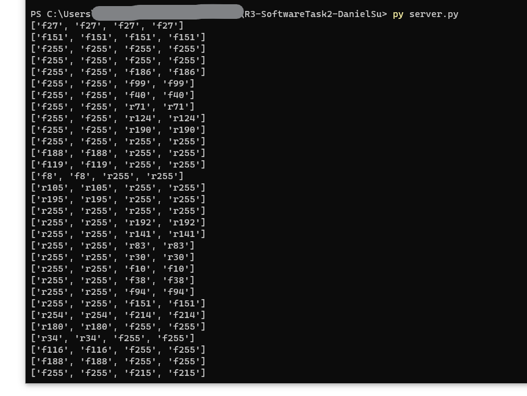
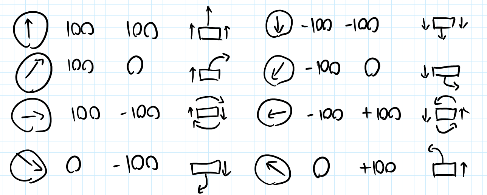
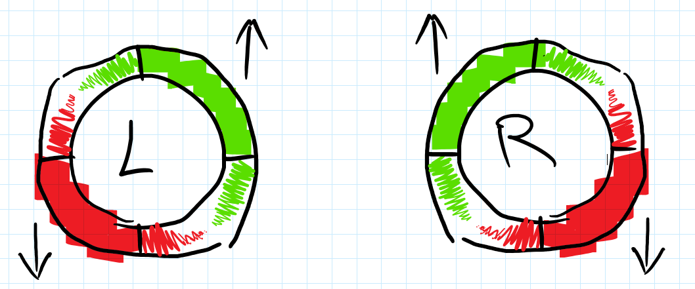
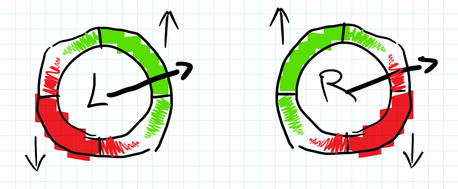
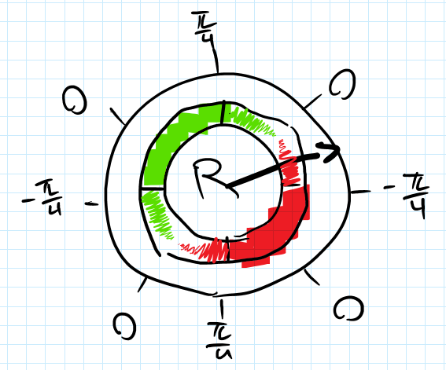

# R3-SoftwareTask2-DanielSu
 
A program to turn controller joystick movement into PWM motor speeds.

Link to video: https://drive.google.com/file/d/1bb4uqE6xzfQBp5USOXAwiVLbWV7W9CB0/view?usp=sharing

The clarity and accuracy of this readme will be hindered by my general lack of knowing what I am doing. It will also be hindered by funny looking diagrams.

Pygame is used to get the joystick inputs. The input values from the joystick is sent from the client to the server program, which then performs the necessary calculations. 

First off, I made some assumptions on how the rover would move when the joystick was in a diagonal position. The below diagram shows how I thought it would work. The numbers are percents, with the sign indicating direction. 

Since the joystick inputs are divided into horizontal and vertical axis values, the quadrant the joystick is in can be found by checking if it is pointing left or right and up or down.

In the diagram below, the behaviour of the left and right pairs of motors depending on the angle of the joystick is shown. Green represents forward motion and red represents reverse motion. Solid coloured quadrants means full speed, and the squiggles represent increasing/decreasing speeds.

For example: if the joystick is pointing "east-northeast", the left motors would be at 100% speed forwards, and the right motors would be at a reduced speed backwards. 

To find the speed of the right motors, the angle of the joystick is measured from the centre of each quadrant. This determines the percentage speed of the motor, as well as the direction.

Next is finding the magnitude of the joystick's displacement. This is done with the Pythagorean theorem. The magnitude is multiplied with the percentage speeds found with the angle to get the final speeds and direction for each pair of motors. 